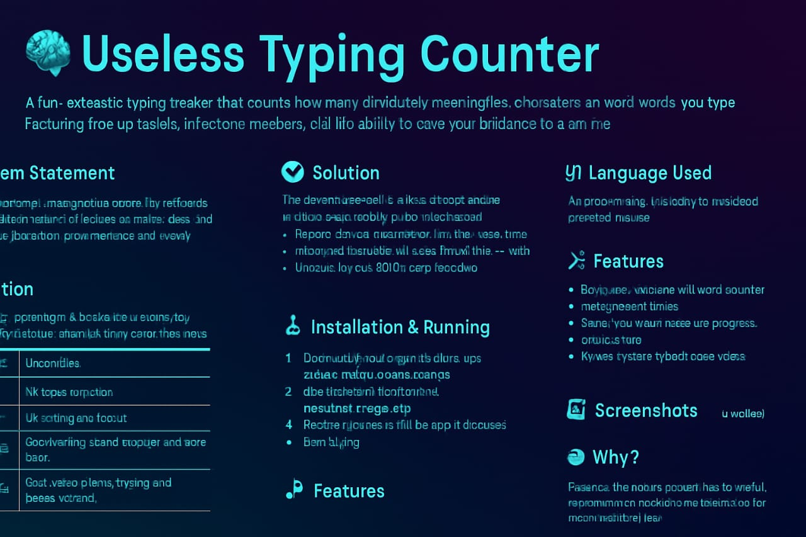

# USELESS CLICK COUNTER

## Basic Details
### Team Name: AMIGOS
### WEBSITE LINK
<a href="https://amigos333.github.io/USELESS-CLICK-COUNTER/useless%20project.html">Click here</a>
### Team Members
- Team Lead: AKASH M M - NSS COLLEGE OF ENGINEERING PALAKKAD
- Member 2: DHANUSH AJAYAN  - NSS COLLEGE OF ENGINEERING PALAKKAD

### Project Description
Ever clicked a button for no reason?
Now you can do it in style! 🎩
The Useless Click Counter is an Excel-based productivity vacuum built entirely in VBA. Every time you click the big shiny button, it keeps count and tells you how much time you’ve wasted — politely. Sometimes it even pretends to care by giving you fake achievements. 🎖

### The Problem (that doesn't exist)
In a world full of productivity apps, complex formulas, and goal-oriented Excel sheets, there's one thing missing:
> A button that does absolutely nothing useful — and counts how often you click it.
Sometimes, we don’t need to calculate revenue, automate data entry, or create dashboards.
Sometimes… we just want to click a button and be told how many times we did it. 😐

### The Solution (that nobody asked for)
The Useless Click Counter.
One button 🖱
One counter ➕
One purpose: Pointless fun 🔁
What it does:
Adds a clickable button to an Excel sheet
Every click:
Increases a counter

Shows a message like:
> "You've clicked this button 42 times. And nothing happened."
Optional features:
🎉 Achievement popups at milestones (100, 500 clicks)
🔊 Beep sound on each click
🎊 Confetti using cell colors
🔥 Fake overheating warnings (for laughs)
What it does not do:
Perform useful calculations ❌
Improve Excel productivity ❌
Change your life ❌

## Technical Details
### Technologies/Components Used
For Software:
🧠 Tech Used
Language

🧾 VBA (Visual Basic for Applications)	Programming language used to write the click-counting macro
🖱 Form Controls (Button)	Used to create the clickable button inside Excel
🧠 Excel Macros	Runs the code when the button is clicked
💻 VBA Editor (Alt + F11)	Environment to write and edit the VBA code

Feature	Tech Used

🔊 Beep sound	Beep command in VBA
🎖 Achievements	MsgBox with conditionals
🎊 Confetti cells	VBA Range().Interior.Color
🚨 Overheat warning	Conditional messages after 500 clicks

### Implementation
For Software:
The Useless Click Counter is implemented using VBA (Visual Basic for Applications) inside Microsoft Excel. It creates a button that triggers a macro every time it's clicked, incrementing a counter and displaying a message.
# Installation
No installation required

# Run
Option 1: Run Locally in Your Browser
1. Create an HTML file:
Open any text editor (like Notepad, VS Code, or Sublime).
Paste your HTML code into it.
2. Save the file:

Save the file as:
useless-typing-counter.html
3. Add your sound files:
  Place the following audio files in the same folder:
  html/bomb-dropping-101151.mp3 (you can rename any funny typing sound to this)
  pop.mp3 (a popping sound)
4. Open it:
Double-click the .html file.
It will open in your default web browser.
Start typing and enjoy the sarcasm! 🤪

### Project Documentation
For Software:

# Screenshot (1)
(""

# screenshot(2)
""

# screenshort(3)
"
#EVERY CLICK COUNTS...EVEN IF IT DOESN'T
#A playful web tool where each clck increments the count, yet serves no functional beyond amusement.It"s a lghthearted demonstration of event handling,DOM update,and JavaScript interactivity, showing how something simple can still be oddly satisfying.

## Team Contributions
- Akash M M - Came with brilantly pointless idea for the Useless Click Counter,
Omptimized code to ensure that the useless counter runs smoothly and pointlessly

- Dhanush Ajayan - Developed the frontend design and integrated stylish fonts,
Managed GitHub repository and README documentattion.

---
Made with ❤️ at TinkerHub Useless Projects 

